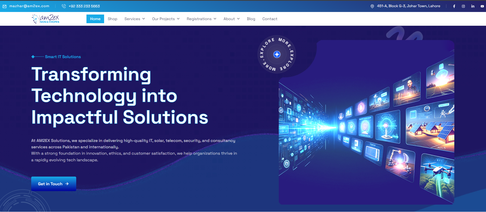
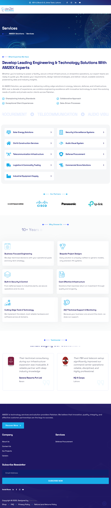
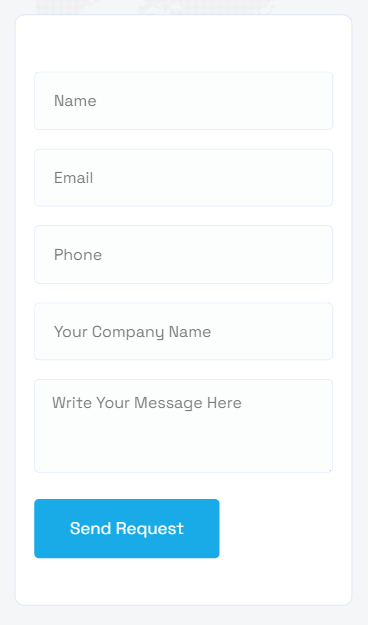

# AM2EX E-Commerce Website – Case Study
A custom WooCommerce store for AM2EX, designed for a smooth shopping experience with optimized checkout flow.

## 📌 Project Overview
The goal was to create a responsive e-commerce site with clear product categories, fast page loads, and an efficient checkout system to maximize conversions.

## 🛠 Tech Stack
- **WordPress**
- **WooCommerce**
- Elementor Pro
- Payment Gateway Integration
- LiteSpeed Cache
  
## 💼 My Role
- WooCommerce setup & configuration
- Product category and filter design
- Checkout flow optimization
- Mobile responsiveness tuning
- Basic SEO for product pages
  
## 🚀 Key Results
- Reduced checkout abandonment by streamlining steps
- Improved mobile shopping experience
- Integrated secure payment gateways
  
## ⚡ Challenges & Solutions
**Challenge:** Long and confusing checkout process. 

**Solution:** Customized checkout page to minimize fields and improve clarity.

## 🔗 Live Project

[Visit AM2EX](https://am2ex.com/)

## Screenshots  

📸 View Screens

**Homepage**  
 
**Services Page**
 
**Contact Page**  
  

