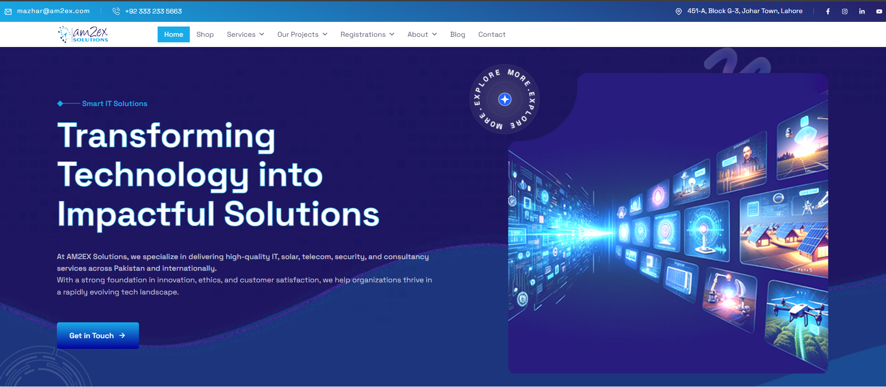
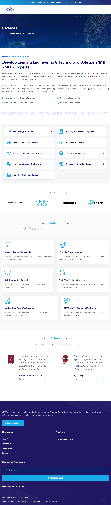
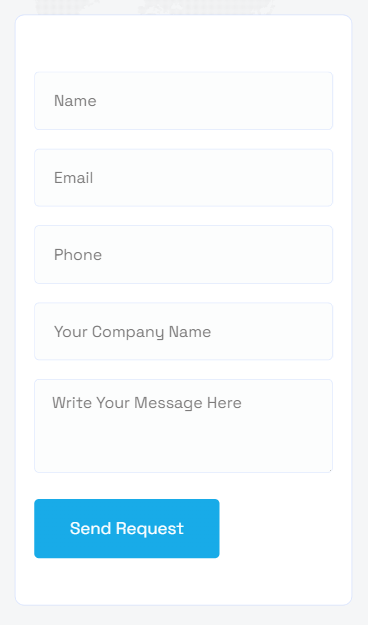

# AM2EX E-Commerce Website | Case Study

A custom WooCommerce store for AM2EX, built for a smooth shopping experience and a simpler checkout flow.

## Project Overview

The goal was a responsive e-commerce site with clear product categories, fast load times, and a checkout process that didn't lose customers halfway through.

## Tech Stack

- WordPress
- WooCommerce
- Elementor Pro
- Payment gateway integration
- LiteSpeed Cache

## My Role

- WooCommerce setup and configuration
- Product category and filter design
- Checkout flow optimization
- Mobile responsiveness tuning
- Basic SEO for product pages

## Key Results

- Reduced checkout abandonment by simplifying the steps
- Improved mobile shopping experience
- Integrated secure payment gateways

## Challenge

The original checkout process was long and confusing.

## Solution

Customized the checkout page to cut down fields and make each step clearer.

## Live Project

Visit [AM2EX](https://am2ex.com/)

## Screenshots

  
View

  

  

