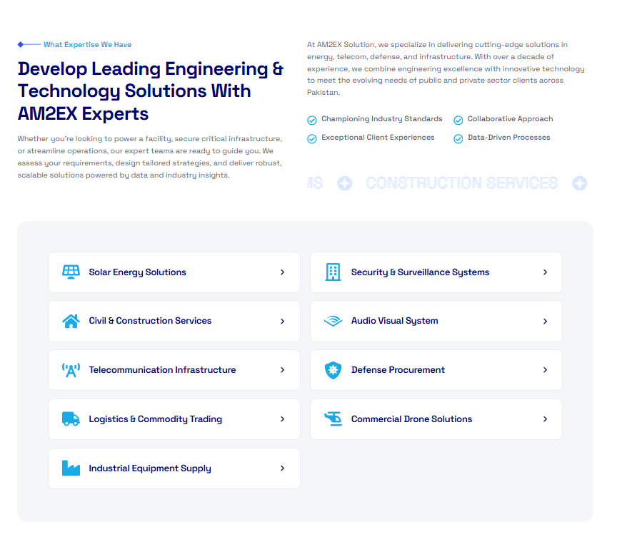

# AM2EX – Case Study  

This repository contains the case study of the AM2EX E-commerce website project, built with WordPress, WooCommerce, and Elementor.  

## Project Overview  
The goal was to develop a fully functional online store with a smooth shopping experience, secure payment integration, and a professional design. The focus was on creating a user-friendly interface that supports quick product browsing and checkout.  

## Key Features  
- Fully responsive online store  
- WooCommerce product catalog setup  
- Integrated secure payment gateways  
- Custom Elementor templates for shop and product pages  
- Optimized loading speed and SEO-friendly structure  

## Tools & Technologies  
- WordPress  
- Elementor & Elementor Pro  
- WooCommerce  
- LiteSpeed Cache  
- Yoast SEO (or other SEO plugin)  
- Image optimization plugins (e.g., Smush or ShortPixel)  

## My Role  
- Theme setup & customization  
- WooCommerce configuration  
- Payment gateway integration  
- Performance optimization via caching & image compression  
- Product page layout design using Elementor  

## Project Link  
[Live Website](https://am2ex.com/)  

## Screenshots  
  
 
  

